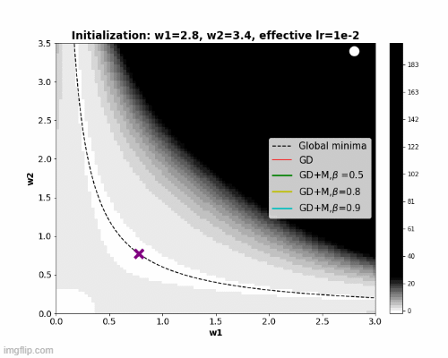

# Implicit-regularization-for-momentum-SGD (ICLR-2023 Spotlight)

## Table of Contents
- [One-time Setup](#one-time-setup)
- [Updating](#updating)
- [Working with the Code](#working-with-the-code)
- [Experiments](#Reproducing-results)
  - [Implicit bias for 2 linear scalar factor](#Implicit-bias-for-2-linear-scalar-factor)
  - [Implicit bias for 2 scalar factor with non-linearity](#Implicit-bias-for-2-scalar-factor-with-non-linearity)
  - [SGD with momentum experiments on deep networks](#SGD-with-momentum-experiments-on-deep-networks)

## One-time Setup
1. Install a working version of conda.
2. Create a conda environment: 
    ```
    conda env create -f environment.yml
    ```
3. Activate the conda environment: 
    ```
    conda activate momentum
    ```

## Updating
1. Pull the latest changes: 
    ```
    git pull
    ```
2. Update the conda environment: 
    ```
    conda env update -f environment.yml
    ```

## Working with the Code
Activate the conda environment before working with the code: 
    ```
    conda activate momentum
    ```

## Reproducing results

### Implicit bias for 2 linear scalar factor 



To generate Figure-1 in the manuscript, please run the `2D_example.ipynb` notebook. The notebook contains instructions sequentially.

### Implicit bias for 2 scalar factor with non-linearity
To generate Figure-3 in the appendix, please run the `2D_Sigmoid.ipynb` notebook. The notebook contains instructions sequentially.

### SGD with momentum experiments on deep networks
Run the following command to generate Figure-4 in the paper:
    ```
    python train.py --model [model-name] --batch_size [batch-size] --learning_rate [lr] --momentum [beta] --dataset [dataset]
    ```
#### Available Options
- `model-name`: Choose from 'resnet18', 'resnet50', 'densenet121', 'wide'
- `dataset`: Choose from 'cifar-10', 'cifar-100'


## Citation and Paper

This work has been published in [ICLR-2023](https://openreview.net/forum?id=ZzdBhtEH9yB) as a Spotlight paper. You can read the full paper on [arXiv](https://arxiv.org/abs/2302.00849).

To cite this work, please use the following BibTeX entry:

```bibtex
@article{ghosh2023implicit,
  title={Implicit regularization in Heavy-ball momentum accelerated stochastic gradient descent},
  author={Ghosh, Avrajit and Lyu, He and Zhang, Xitong and Wang, Rongrong},
  journal={arXiv preprint arXiv:2302.00849},
  year={2023}
}

